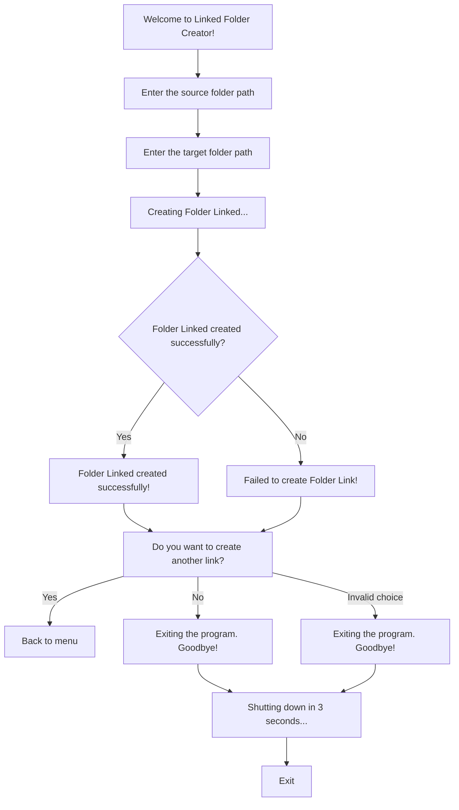
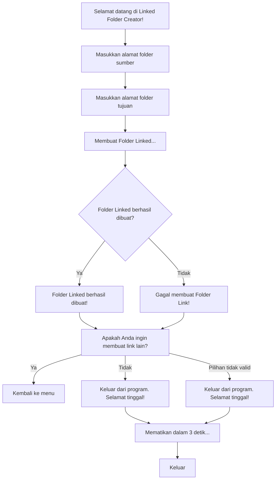

# Linked Folder Creator
Aplikasi ini digunakan untuk menghubungkan folder 1 dengan folder baru
 
[This application is used to link one folder with a new folder]
 
 Link Download bat file : [link](start.bat)
 
 
 Diagram English

 Diagram Indonesia

 
